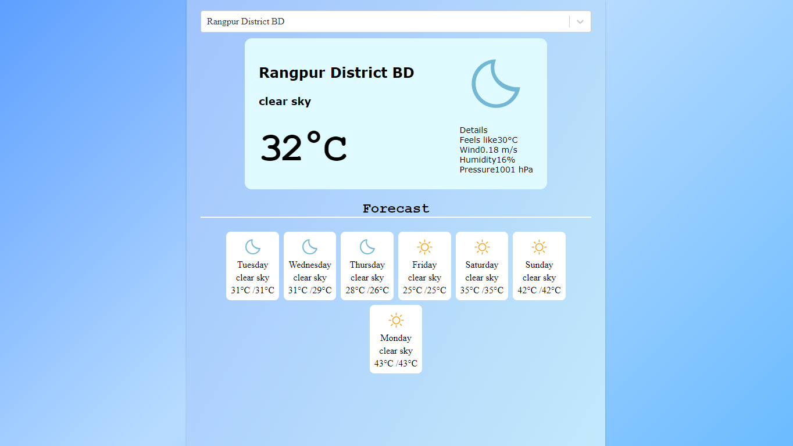

## Preview

# Weather App with ReactJS and Vite

Welcome to my Weather App built with ReactJS using the Vite-React tool. This app allows users to check the current weather conditions of any location around the world.

## Features

- **Current Weather:** View the current weather conditions including temperature, humidity, wind speed, and weather description.
- **Search Functionality:** Search for weather information by city name.
- **Geolocation:** Get weather information based on your current location using GeoDB API.
- **Responsive Design:** The app is designed to work seamlessly on various screen sizes, from desktop to mobile devices.

## APIs Used

- **OpenWeather API:** Used to fetch current weather data based on city name.
- **GeoDB API:** Used to retrieve location data for the user's current location.

## Tech Stack

- **ReactJS:** A JavaScript library for building user interfaces.
- **Vite:** A fast build tool for modern web development.

